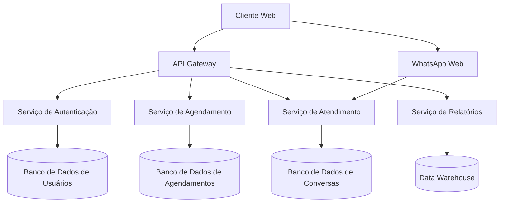

# Arquitetura do Sistema

## 1. Visão Geral

O AgendVluma segue uma arquitetura baseada em microsserviços, permitindo escalabilidade e manutenção simplificada.

## 2. Diagrama de Arquitetura



## 3. Componentes Principais

### 3.1 Frontend
- **Tecnologias**: React.js, TypeScript, TailwindCSS
- **Principais Bibliotecas**:
  - React Query para gerenciamento de estado
  - Socket.IO para comunicação em tempo real
  - React Hook Form para formulários
  - React Router para navegação

### 3.2 Backend
- **Tecnologias**: Node.js, Express, TypeScript
- **Estrutura de Pastas**:
  ```
  src/
  ├── config/       # Configurações
  ├── controllers/  # Lógica de negócios
  ├── models/       # Modelos de dados
  ├── routes/       # Rotas da API
  ├── services/     # Serviços de negócios
  ├── middlewares/  # Middlewares
  └── utils/        # Utilitários
  ```

### 3.3 Banco de Dados
- **Sistema Principal**: PostgreSQL
- **Cache**: Redis
- **Mensageria**: RabbitMQ
- **Armazenamento de Arquivos**: AWS S3

## 4. Fluxo de Dados

1. **Autenticação**
   - JWT para autenticação stateless
   - Refresh tokens para renovação de sessão
   - Rate limiting para prevenção de ataques

2. **Processamento de Agendamentos**
   - Validação de horários
   - Verificação de conflitos
   - Notificações em tempo real

3. **Integração WhatsApp**
   - Webhooks para recebimento de mensagens
   - Fila de processamento assíncrono
   - Template de mensagens

## 5. Segurança

### 5.1 Proteção de Dados
- Criptografia em repouso e em trânsito
- Máscara de dados sensíveis
- Logs de auditoria

### 5.2 Conformidade LGPD
- Gerenciamento de consentimento
- Portabilidade de dados
- Exclusão segura

## 6. Monitoramento

### 6.1 Logs
- Centralização com ELK Stack
- Níveis de severidade
- Rastreamento de erros

### 6.2 Métricas
- Uso de recursos
- Tempo de resposta
- Taxa de erros

## 7. CI/CD

### 7.1 Pipeline de Desenvolvimento
- Linting e testes automatizados
- Análise estática de código
- Build e deploy automatizados

### 7.2 Ambientes
- Desenvolvimento
- Homologação
- Produção

## 8. Escalabilidade

### 8.1 Horizontal
- Balanceamento de carga
- Auto-scaling
- CDN para arquivos estáticos

### 8.2 Vertical
- Otimização de consultas
- Cache em múltiplas camadas
- Processamento assíncrono
